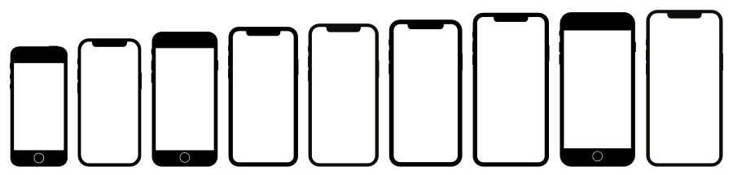

# 📱 React Native Responsive Pixels
<br/>

<br/>

[](https://www.npmjs.com/package/react-native-responsive-pixels)

[](https://www.npmjs.com/package/react-native-responsive-pixels) [](https://www.npmjs.com/package/react-native-responsive-pixels)  [](https://opensource.org/licenses/MIT)

# Contents
* [Description](#description)
* [Installation](#installation)
* [Usage](#usage)
* [Example](#example)
* [Author](#author)
* [License](#license)
* [Contribution](#contribution)

## Description
This package is created for responsive UI calculations in React Native. If you are using a base device or dimensions to create UI this package can help you.<br/>

E.g. You are creating the UI based on the desings that created on iPhone X in Figma. 
If you wanted to have same look on all devices, you just need to set base device as iPhone X then use the values on your design.
This package is going to help you about responsive calculations.

## Installation
This is a pure JS library so you just need to install npm package. To install this package run the command below on Terminal.

```bash
npm install react-native-responsive-pixels --save
```

## Usage
### Sample Usage
You can just import methods and use it with values.
```jsx
import React from 'react';
import { convertX, convertY, scaleFont } from 'react-native-responsive-pixels';

const BASE_WIDTH = 375;
const BASE_HEIGHT = 812;

const App = () => {
  return (
    <View style= {{width: convertX(300, BASE_WIDTH), height: convertY(500, BASE_HEIGHT) }}>
        <Text style={{ fontSize: scaleFont(24, BASE_WIDTH) }}> 
            Lorem ipsum dolor sit amet.
        </Text>
    </View>
  );
};

export default App;
```

### Recommended Usage
Recommended usage is creating an util file and setting base device's dimensions once. Then using methods from utils file.

`Util.ts` file 👇
```jsx
import { convertX, convertY, scaleFont, Devices } from 'react-native-responsive-pixels';

const BASE_WIDTH = 375;
const BASE_HEIGHT = 812;

export const getXValue = (value: number) => {
  return convertX(value, BASE_WIDTH);
}

export const getYValue = (value: number) => {
  return convertY(value, BASE_HEIGHT);
}

export const getFontSize = (value: number) => {
  return scaleFont(value, BASE_WIDTH);
}
```

`App.tsx` file 👇
```jsx
import React from 'react';
import { convertX, convertY, scaleFont } from './utils.ts';

const App = () => {
  return (
    <View style= {{width: getXValue(300), height: getYValue(500) }}>
        <Text style={{ fontSize: scaleFont(24) }}> 
            Lorem ipsum dolor sit amet.
        </Text>
    </View>
  );
};

export default App;
```

### Using "Devices" Enum
If you don't know your base device's width and height, you can select it from "Devices" enum. It automatically gets base width and height for desired device.

`Util.ts` file 👇
```jsx
import { convertX, convertY, scaleFont, Devices } from 'react-native-responsive-pixels';

export const getXValue = (value: number) => {
  return convertX(value, Devices.iPhoneX);
}

export const getYValue = (value: number) => {
  return convertY(value, Devices.iPhoneX);
}

export const getFontSize = (value: number) => {
  return scaleFont(value, Devices.iPhoneX);
}
```

Then you can import and use this methods.

## Example
You can find the an example in [example](https://github.com/hknakn/react-native-responsive-pixels/tree/master/example) folder.

## Author
[Hakan Akın](https://github.com/hknakn) - cehakanakin@gmail.com

## License 
React Native Pixels Library is available under the MIT license. See the LICENSE file for more info.

## Contribution
Pull requests are welcome! Please create PR to `development` branch.
